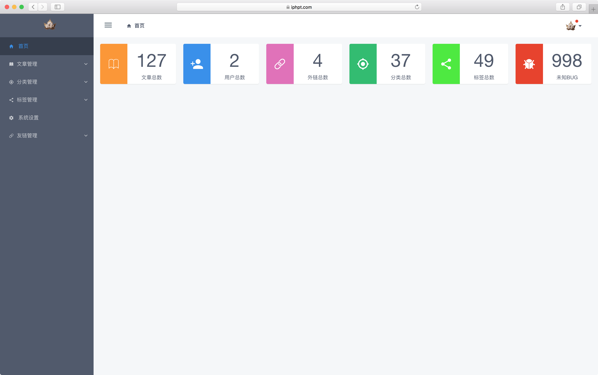
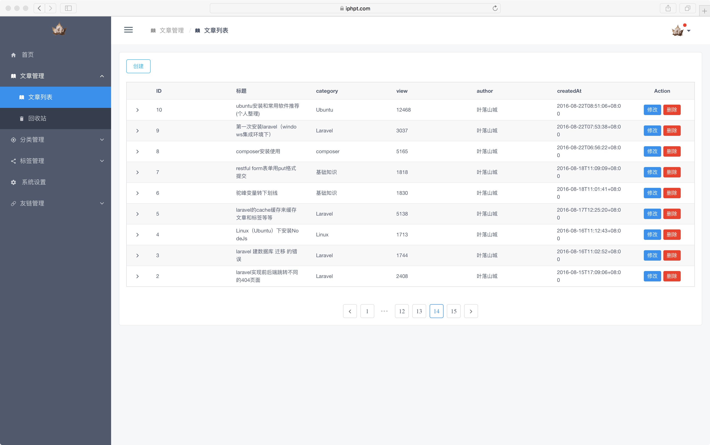
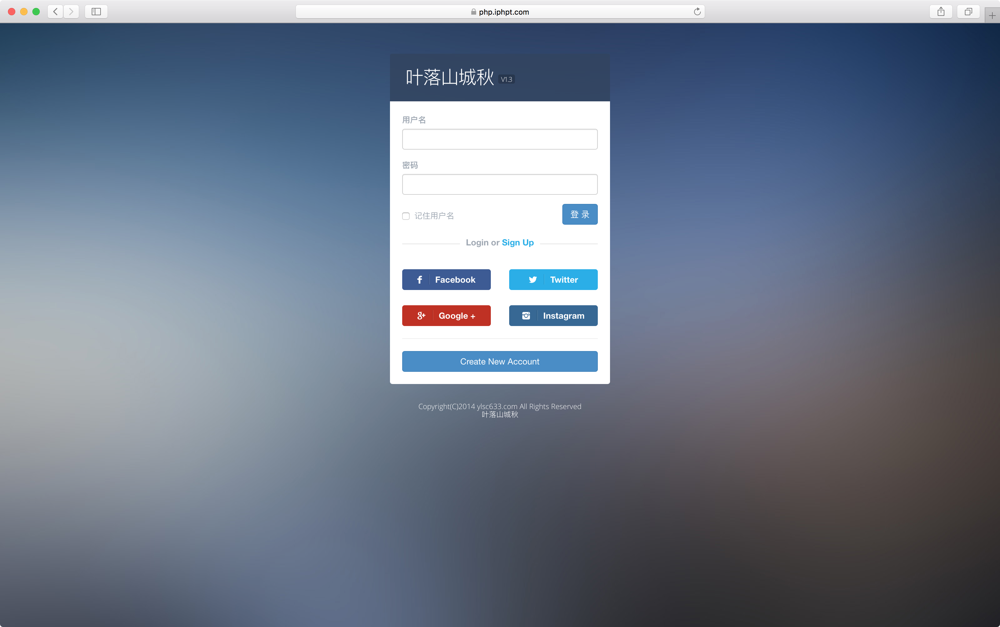
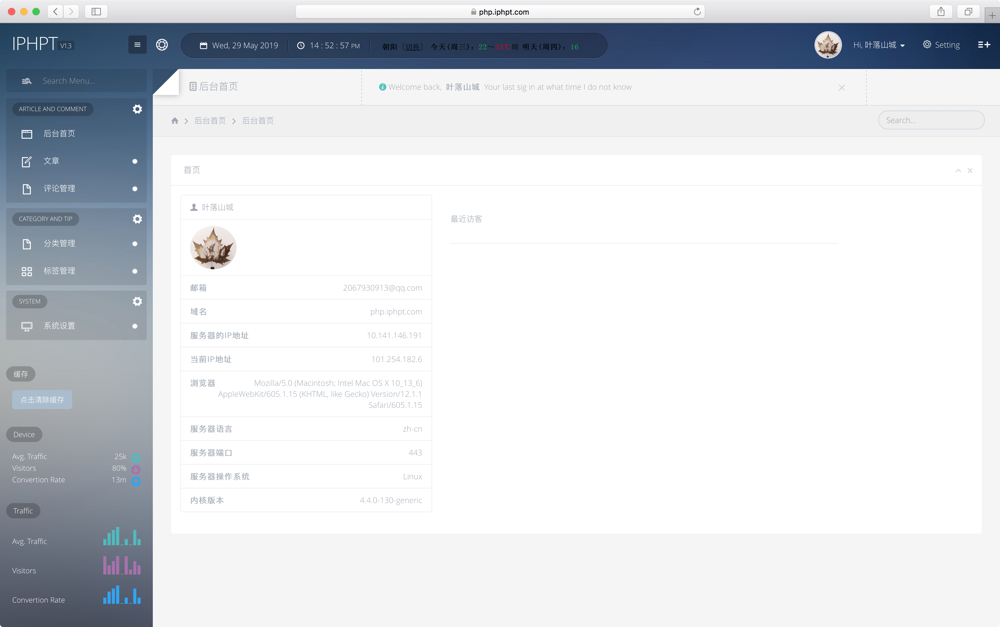
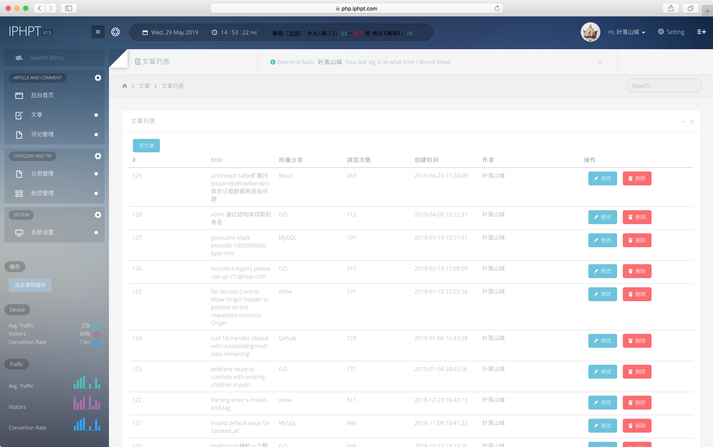

# go-blog

Address: [https://www.iphpt.com](https://www.iphpt.com)

> I spent some time refactoring alone!

[中文文档](./README.CN.md)

## main:

1. Article release and modification
2. Article Recycle Bin and Withdrawal
3. Article categories
4. Article tags
5. Website information freedom setting
6. Article support markdown
7. ★ Website static files can be freely configured `local` or `CDN`
8. ★ You can choose to upload images to `server` or `qiniu` or both at the same time.
9. Freely add friendchain and manage friend chain order
10. Using the `issue` function of `github` as a commenting system, the interface is beautiful and convenient for other users to leave messages and notifications.
11. ★ Regularly back up data and static resources
12. ★ Backup data mail is sent to the mailbox

## Technical point:

###  The main code is `golang`+`vue`+`HTML`+`CSS`+`MySql`

    - The backend code is a self-contained package based on the `golang` `gin` framework.  [https://github.com/izghua/zgh](https://github.com/izghua/zgh)
    - The background code is based on the `iview` UI component development of `vue`, [https://github.com/izghua/go-blog-backend](https://github.com/izghua/go-blog-backend)
    - The front desk is based on `HTML+CSS`, the display page [https://www.iphpt.com](https://www.iphpt.com)
    - The cache is `redis`
    - The database is `MySql`
    - The Configuration file is`yaml`
    
### How to install

[go-blog安装教程](https://www.iphpt.com/detail/130)    

    
### history

This site started in 2015 and was originally built by the `zblog` open source framework.

In 2016, I used the `Larvel` framework of `PHP` to refactor all the code at the front and back
    - Web: [http://php.iphpt.com](http://php.iphpt.com)
    - Code: [https://github.com/xzghua/laravel-5-myblog](https://github.com/xzghua/laravel-5-myblog)

In 2019, I refactored it again with `Golang`
    - Web: [https://www.iphpt.com](https://www.iphpt.com)
    - Code: [https://github.com/izghua/go-blog](https://github.com/izghua/go-blog)

### Sample image        
 
NEW:
   - backend-login: 
   - backend-home: 
   - backend-list: 

OLD:
   - backend-login: 
   - backend-home: 
   - backend-list: 

 
